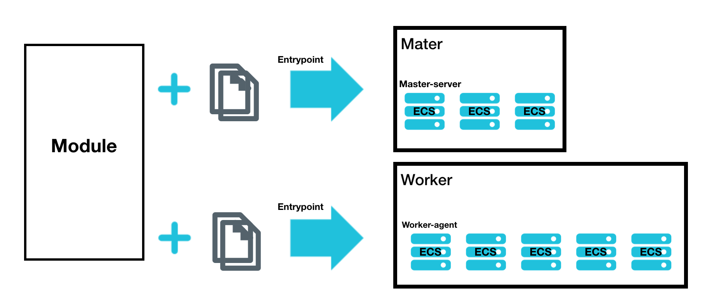

## APP Deployer Terraform Module Based on Alicloud
=====================================================================

This module helps you prepare the deployment environment based on Alicloud public cloud IAAS resources or even start your app.
This module provides these things for you:

- Create the IAAS machines according to your definition with multiple roles. Eg. master, worker, etc.
- Render the configuration files based on the IAAS machines information and upload the files to the created machines.
- Run some commands right after the machine is created and after preparing the configuration files and other contents.

NOTE: You have to provide one VPC and VSwitch and the corresponding availability_zone for this module. If not provided, the module won't create a default VPC for now.

NOTE: This module using AccessKey and SecretKey are from profile and shared_credentials_file. If you have not set them yet, please install aliyun-cli and configure it.



Usage
-----

1. Creating a vpc, please ignore this step if you already have one.

```
module "vpc" {
  source = "alibaba/vpc/alicloud"

  region       = var.region != "" ? var.region : null
  vpc_name     = "my_vpc"
  vswitch_name = "my_vswitch"

  vswitch_cidrs = [
    "172.16.1.0/24",
  ]
}
```

2. Adding `app-deployer` module resource to your template, e.g. main.tf

```
module "app-deployer" {
  source = "../../"

  region = var.region != "" ? var.region : null
  availability_zone = module.vpc.this_availability_zones[0]
  vpc_id            = module.vpc.this_vpc_id

  app_name = "example"
  instance_settings = [
    {
      identifier        = "master"
      description       = "master node"
      hostnamePrefix    = "master"
      ecs_password      = "Example123"
      image_id          = null
      image_owners      = null
      image_name_regex  = null
      instance_type     = null
      cpu               = 2
      memory            = 4
      system_disk_size  = 100
      data_disks        = null
      max_bandwidth_out = 100
      security_groups   = null
      vswitch_id        = module.vpc.this_vswitch_ids[0]
      private_ip        = null
      user_data         = null
      temp_files        = ["temp_files/master_template.file"]
      static_files      = ["static_files/master_static.file"]
      entrypoint        = "echo SUCCESS"
      size              = 2
    },
    {
      identifier        = "worker"
      description       = "worker node"
      hostnamePrefix    = "worker"
      ecs_password      = "Example123"
      image_id          = null
      image_owners      = null
      image_name_regex  = null
      instance_type     = null
      cpu               = 4
      memory            = 8
      system_disk_size  = 100
      data_disks        = [
          name = "vdb"
          size = 200
          category = cloud_efficiency
          delete_with_instance =true
      ]
      max_bandwidth_out = 100
      security_groups   = null
      vswitch_id        = module.vpc.this_vswitch_ids[0]
      private_ip        = null
      temp_files        = ["temp_files/worker_template.file"]
      static_files      = ["static_files/worker_static.file"]
      user_data         = null
      entrypoint        = "echo SUCCESS"
      size              = 3
    }
  ]
}
```

NOTE: Due to the limitation of terraform, you need to assign a value to each field. If it is not really needed, assign a value to null. For more details, please refer to [Optional arguments in object variable type definition](https://github.com/hashicorp/terraform/issues/19898).

3. Setting access_key and secret_key values through environment variables:

```
ALICLOUD_ACCESS_KEY
ALICLOUD_SECRET_KEY
```

## Inputs

| Name | Description | Type | Default | Required | Vaild When |
|------|-------------|:----:|:-----:|:-----:|:-----:|
| region | The region ID used to launch this module resources. If not set, it will be sourced from followed by ALICLOUD_REGION environment variable and profile | string  | - | no  | - |
| profile | The profile name as set in the shared credentials file. If not set, it will be sourced from the ALICLOUD_PROFILE environment variable. | string  | - | no  | - |
| shared_credentials_file | This is the path to the shared credentials file. If this is not set and a profile is specified, $HOME/.aliyun/config.json will be used. | string  | - | no  | - |
| skip_region_validation | Skip static validation of region ID. Used by users of alternative AlibabaCloud-like APIs or users w/ access to regions that are not public (yet). | bool  | false | no  | - |
| availability_zone | The available zone to launch this module resources. The value should be consistent with your VPC. | string | - | yes | - |
| vpc_id | The vpc id. If this is not set and no default value will be used. | string | - | yes | - |
| owner | The owner identifier who deploy the app. | string | default | no | - |
| app_name | The name of app that you will deployed. And all files you defined in the instance_settings will be placed under /tmp/app_name. | string | default | yes | - |
| instance_settings | The instance settings which contains the instance resoure definitions, the file path that need to be uploaded to the machine and the entrypoint that need to be run after the resources are ready. | list(object) | - | yes | - |

### Instance Settings

| Name | Description | Type | Required |
|------|-------------|:----:|:-----:|
| identifier | The resource identifier which used to group resources. | string | yes |
| description | The description for group identifier resources. | string | no |
| size | The number of instances of group identifier which equals the [Resource.count](https://www.terraform.io/docs/configuration/resources.html#count-multiple-resource-instances-by-count). | number | yes |
| hostnamePrefix | The hostname prefix of instance. The real host name will be `${hostnamePrefix}${index}`. | string | no
| ecs_password | The password of root user. | string | yes |
| image_id | Use the specified image id. | string | no |
| image_owners | Filter results by a specific [image owner](https://www.terraform.io/docs/providers/alicloud/d/images.html#owners). Valid items are system, self, others, marketplace. | string | no |
| image_name_regex | A regex string to filter resulting images by name. | string | no |
| instance_type | The type of instance to start. If it's not specified, the module will auto select one according to the cpu and memory. | string | no |
| cpu | A specific number of cpu cores. | number | no |
| memory | A specific memory size in GB. | number | no |
| system_disk_size | Size of the system disk, measured in GiB. Value range: [20, 500]. | number | yes |
| data_disks | The list of [data disks](https://www.terraform.io/docs/providers/alicloud/r/instance.html#data_disks) created with instance. | list(map(string)) | no |
| max_bandwidth_out | Maximum outgoing bandwidth to the public network, measured in Mbps (Mega bit per second). **NOTE: Only when the `max_bandwidth_out` greater than zero, the instance will be allocated a public IP.** | number | no |
| security_groups | A list of security group ids to associate with. If not specified, a security group will be generated automatically. **NOTE: The ingress ssh should be allowed by using default port `22` for uploading files.** | list(string) | no |
| vswitch_id | The virtual switch ID to launch in VPC. This parameter must be set unless you can create classic network instances. | string | yes |
| private_ip | Instance private IP address can be specified when you creating new instance. | list(string) | no |
| user_data | User-defined data to customize the startup behaviors of an ECS instance and to pass data into an ECS instance. Refer to [link](https://cloudinit.readthedocs.io/en/latest/topics/format.html). | string | no |
| temp_files| A list template file path which should be rendered after instance created. | list(string) | no |
| static_files| A list static file path.  | list(string) | no |
| entrypoint | The entrypoint that you want to run after all environments be ready which including files will be uploaded. | string | no |

NOTE: Both the rendered `temp_files` and `static_files` will be uploaded to the corresponding identifier instances which under the dir `/tmp/$app_name/`. 

## Outputs

| Name | Description |
|------|-------------|
| this_instanceList | A list containing all instance details |
| this_availability_zone | The zone id used. |

Terraform version
-----------------
Terraform version 0.12.0+ is required for this module to work.

Authors
-------
Created and maintained by Liu Yuxing(@Starnop starnop@163.com)

Reference
---------
* [terraform-alicloud-vpc Github](https://github.com/terraform-alicloud-modules/terraform-alicloud-vpc)
* [terraform-alicloud-ecs-instance Github](https://github.com/terraform-alicloud-modules/terraform-alicloud-ecs-instance)
* [Terraform-Provider-Alicloud Docs](https://www.terraform.io/docs/providers/alicloud/)

